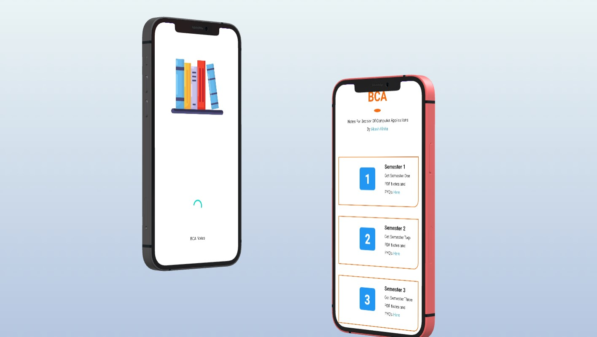
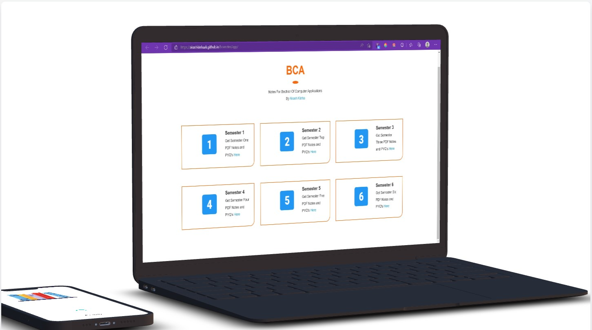

Welcomw TO AKASH World

<h1>Android App </h1>
#Made Using Android Studio 

<h3>Things Used For Development</h3>
<ul>
  <li> JAVA - Language For Backend  </li>
  <li> XML Designing For Frontend </li>
  <li> WebView For Displaying WEBAPP Contents </li>
</ul>

<h1> Preview OF APP</h1>

 

 
<h1>WebApp Preview <a href ="" https://akashkinhaak.github.io/bcanotes/app> Here  </a></h1>
<h2>Screenshots : </h2>

Link To Web App
https://akashkinhaak.github.io/bcanotes

